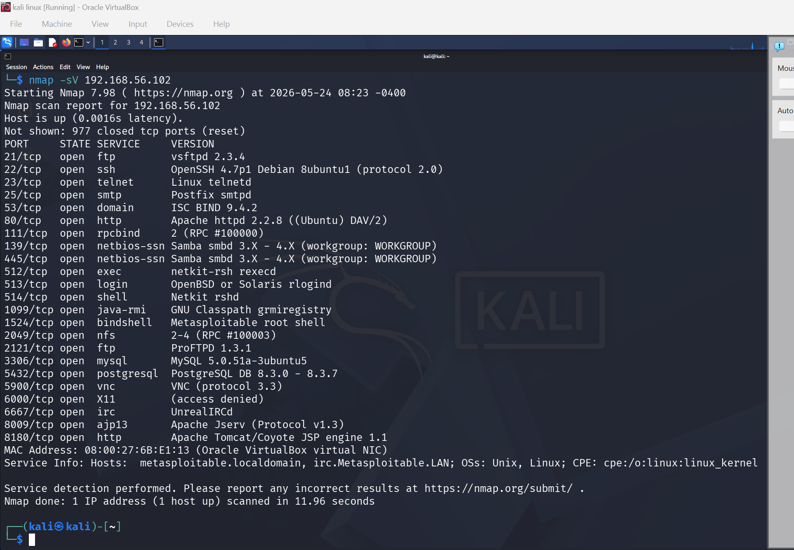
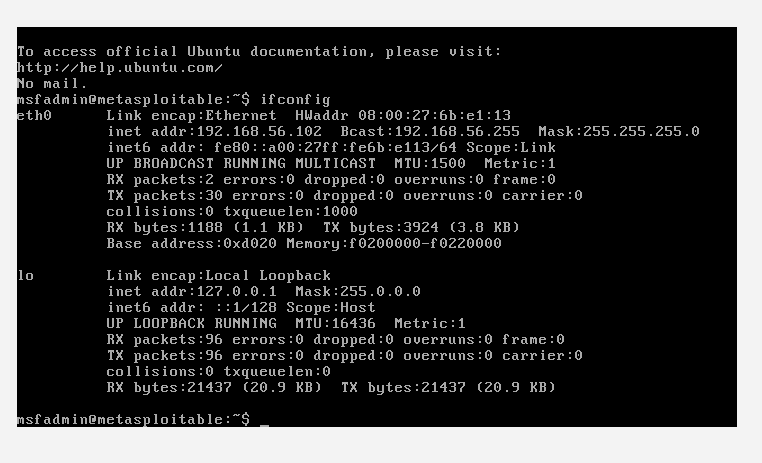

# network-reconnaissance-enumeration
Hands-on network reconnaissance and service enumeration practice using Nmap against isolated lab environments.
# Network Reconnaissance & Enumeration – Nmap Lab Practice

This repository contains hands-on network scanning and service enumeration exercises performed using Nmap against isolated lab environments.

## Objective

To strengthen practical reconnaissance and enumeration skills by identifying open ports, running services, service versions, and potential attack surfaces.

## Tools Used

- Nmap
- Kali Linux
- Metasploitable 2
- VirtualBox

## Activities Performed

- Host discovery
- Port scanning
- Service enumeration
- Version detection
- Attack surface analysis
- Reconnaissance reporting

## Nmap Commands Used

### Basic Scan
```bash
nmap 192.168.56.102
```

### Service Version Detection
```bash
nmap -sV 192.168.56.102
```

### Aggressive Scan
```bash
nmap -A 192.168.56.102
```

## Key Findings

- Multiple open ports identified
- Legacy services such as FTP and Telnet detected
- Database services exposed
- Apache web server and Samba services identified
- Potential attack surfaces documented

## Security Observations

The target system exposed several services that may increase attack surface risk if improperly configured or outdated.

## Recommendations

- Disable unnecessary services
- Restrict remote access services
- Apply firewall filtering
- Use secure protocols
- Keep services updated and patched

## Nmap Scan Screenshot

The screenshot below demonstrates service enumeration and version detection performed using Nmap.



## Project Outcome
## Target System Identification

The screenshot below demonstrates identification of the Metasploitable 2 target IP address using the `ifconfig` command prior to performing network reconnaissance and service enumeration activities.


## Network Reconnaissance & Enumeration – Nmap Lab Practice

The screenshot below demonstrates service enumeration and network reconnaissance performed using Nmap against a Metasploitable 2 lab environment.

Open ports, running services, and service versions were identified to analyse the target attack surface.


